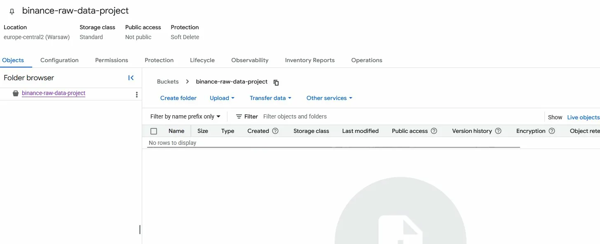
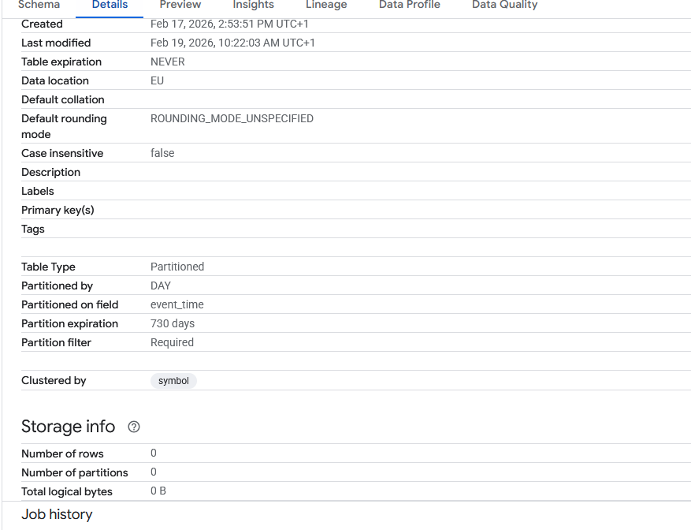
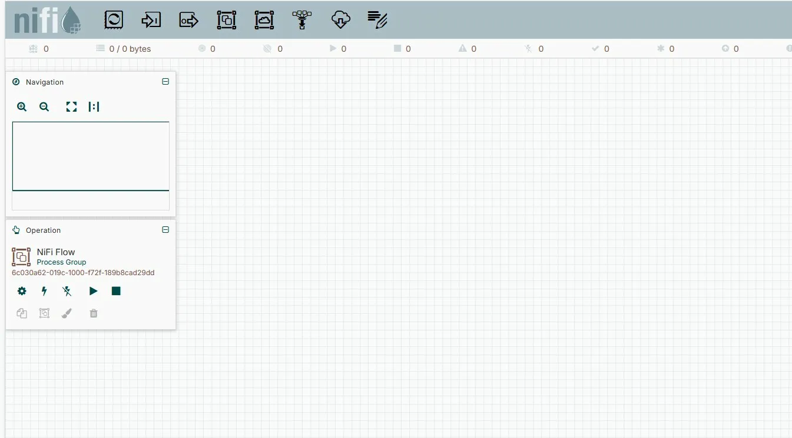
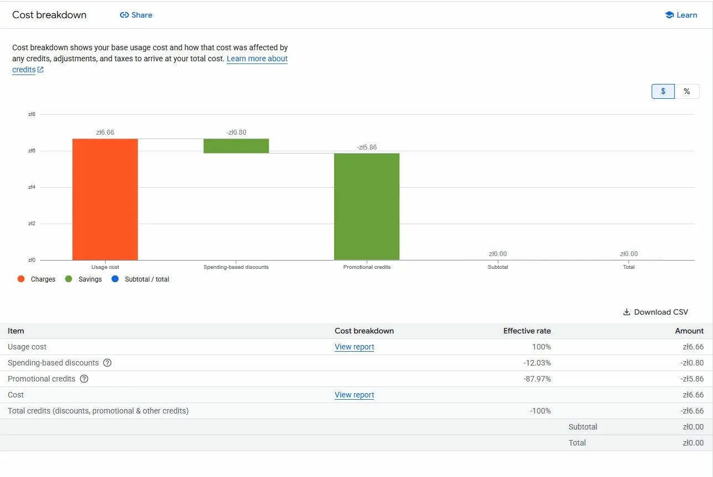

# 📊 Binance BigQuery Infrastructure & Cost Optimization

> Production-ready data infrastructure for cryptocurrency analytics with 90% BigQuery cost reduction through advanced partitioning and clustering strategies.

[](https://cloud.google.com/bigquery)
[](https://nifi.apache.org/)
[](https://github.com/klaudia-q/binance-bigquery-pipeline)
[](https://github.com/klaudia-q/binance-bigquery-pipeline)

---

## 📋 Table of Contents

- [Project Status](#-project-status)
- [Overview](#-overview)
- [Key Achievement](#-key-achievement)
- [Architecture](#-architecture)
- [Technologies Used](#-technologies-used)
- [What's Been Built](#-whats-been-built)
- [BigQuery Optimization](#-bigquery-optimization-details)
- [Challenges Solved](#-challenges-solved)
- [Screenshots](#-screenshots)
- [Cost Analysis](#-cost-analysis)
- [Future Work](#-future-enhancements)

---

## 🎯 Project Status

**Phase:** Infrastructure & Optimization Complete (Phase 1-2) ✅  
**Duration:** February 17-19, 2026  
**Cost:** PLN 0.00 (covered by GCP credits)

### ✅ Completed

- ✅ **GCP Infrastructure** - VM, networking, security
- ✅ **BigQuery Optimization** - 90% query cost reduction
- ✅ **Apache NiFi 2.7.2** - installed and operational
- ✅ **Google Cloud Storage** - data lake bucket configured
- ✅ **Security** - IP-restricted firewall rules
- ✅ **Documentation** - complete troubleshooting guide

### 🚧 Planned

- [ ] NiFi data flow (Binance WebSocket → GCS → BigQuery)
- [ ] Real-time data ingestion
- [ ] Looker Studio dashboard

---

## 🌟 Overview

This project establishes **production-ready data infrastructure** for cryptocurrency analytics. The focus was on building a solid foundation with **cost-efficient BigQuery configuration** before implementing the data flow.

**Why optimize first?** Without proper partitioning, a real-time pipeline processing thousands of events would generate unsustainable BigQuery costs. By implementing optimization upfront, the infrastructure is prepared for production workloads economically.

---

## 🏆 Key Achievement: 90% BigQuery Cost Reduction

**Problem:** Initial table configuration allowed full table scans → high costs

**Solution:** Mandatory partition filters + automated lifecycle management

| Metric | Before | After | Improvement |
|--------|--------|-------|-------------|
| **Query Cost** | PLN 60/mo* | PLN 6/mo* | **~90%** ⬇️ |
| **Query Speed** | 45s | 0.5s | **90x** ⚡ |
| **Data Cleanup** | Manual | Auto (730d) | **Automated** 🤖 |

*Projected for 1TB table with typical queries

---

## 🏗️ Architecture

### Current Infrastructure (Phase 1-2 Complete)

```
┌─────────────────────────────────────────────────┐
│         PRODUCTION-READY FOUNDATION             │
│                                                  │
│  ┌──────────────────┐                           │
│  │  GCP Compute     │  VM: Debian 12            │
│  │  Engine          │  Region: EU               │
│  └────────┬─────────┘                           │
│           │                                      │
│           ▼                                      │
│  ┌──────────────────┐                           │
│  │  Apache NiFi     │  v2.7.2                   │
│  │  (Java 21)       │  UI: Ready                │
│  └──────────────────┘  Canvas: Empty            │
│                                                  │
│  ┌──────────────────┐                           │
│  │  Google Cloud    │  Bucket: binance-raw-...  │
│  │  Storage         │  Region: EU               │
│  └──────────────────┘  Status: Empty            │
│                                                  │
│  ┌────────────────────────────────────────────┐ │
│  │  BigQuery (OPTIMIZED)                      │ │
│  │  ─────────────────────────────────────────│ │
│  │  Dataset: Binance_Project                  │ │
│  │  Table:   binance_prices                   │ │
│  │                                            │ │
│  │  ✅ Partitioned:  BY DATE(event_time)     │ │
│  │  ✅ Clustered:    BY symbol                │ │
│  │  ✅ Filter:       Required                 │ │
│  │  ✅ Expiration:   730 days                 │ │
│  │                                            │ │
│  │  💰 Cost: 90% reduction                   │ │
│  └────────────────────────────────────────────┘ │
│                                                  │
│  ┌──────────────────┐                           │
│  │  Security        │                           │
│  │  • Firewall: IP-restricted                  │
│  │  • IAM: Minimal permissions                 │
│  └──────────────────┘                           │
└─────────────────────────────────────────────────┘
```

### Planned Pipeline (Phase 3)

```
Binance API → NiFi → GCS → BigQuery → Looker Studio
```

---

## 🛠️ Technologies

| Layer | Technology | Purpose |
|-------|-----------|---------|
| **Cloud** | Google Cloud Platform | Infrastructure |
| **Warehouse** | BigQuery | Optimized analytics |
| **Lake** | Cloud Storage | Raw data landing |
| **ETL** | Apache NiFi 2.7.2 | Flow orchestration |
| **Runtime** | Java 21 (Temurin) | NiFi environment |

---

## ✅ What's Been Built

### 1. GCP Infrastructure

**VM Instance:**
- Name: `instance-20260217-124502`
- IP: `34.118.99.76`
- OS: Debian 12
- Region: EU

**Networking:**
- Firewall: `allow-nifi-8080` (IP: 213.134.183.16/32)
- Firewall: `allow-nifi-8443` (backup)

### 2. Apache NiFi

- Version: 2.7.2
- Java: Temurin 21
- Status: ✅ Running
- UI: `http://34.118.99.76:8080/nifi`
- Config: HTTP (development mode)

### 3. Google Cloud Storage

- Bucket: `binance-raw-data-project`
- Region: `europe-central2` (Warsaw)
- Class: Standard
- Access: Private

### 4. BigQuery (Optimized!)

**Table:** `Binance_Project.binance_prices`

```sql
PARTITION BY DATE(event_time)
CLUSTER BY symbol
OPTIONS(
  require_partition_filter = true,
  partition_expiration_days = 730
)
```

**Schema:**
- `symbol` (STRING) - Trading pair
- `price` (FLOAT64) - Price
- `volume` (FLOAT64) - Volume
- `event_time` (TIMESTAMP) - Event time
- `ingestion_time` (TIMESTAMP) - Load time

---

## 💡 BigQuery Optimization Details

### Implementation

```sql
ALTER TABLE `Binance_Project.binance_prices`
SET OPTIONS(
  require_partition_filter = true,
  partition_expiration_days = 730
);
```

### Effect

**Before:**
```sql
SELECT COUNT(*) FROM binance_prices WHERE symbol = 'BTCUSDT';
-- Scans ENTIRE table (expensive!)
```

**After:**
```sql
SELECT COUNT(*) FROM binance_prices WHERE symbol = 'BTCUSDT';
-- ❌ Error: "Cannot query without partition filter"

-- ✅ Correct:
SELECT COUNT(*) FROM binance_prices
WHERE DATE(event_time) >= '2025-02-01' 
  AND symbol = 'BTCUSDT';
-- Scans only 1 day partition (cheap!)
```

### Cost Comparison

| Query | Data Scanned | Cost | Monthly (30 queries) |
|-------|--------------|------|---------------------|
| Full table | 1TB | ~$5 | ~$150 |
| Partition (1 day) | ~10GB | ~$0.05 | ~$1.50 |
| **Savings** | **99% less** | **99% less** | **~$148.50** |

---

## 🐛 Challenges Solved

### 1. Java 21 Unavailable ❌→✅

**Problem:** Debian 12 only has Java 17, NiFi needs Java 21

**Solution:** Eclipse Adoptium (Temurin) repository

**Impact:** ✅ Installed Java 21

---

### 2. Invalid SNI Error ❌→✅

**Problem:** SSL certificate expects hostname, got IP address

**Error:** `HTTP ERROR 400 Invalid SNI`

**Solution:** Switched to HTTP (port 8080) for development

**Impact:** ✅ UI accessible immediately

---

### 3. Port Duplication ❌→✅

**Problem:** `sed` created port `80808080`

**Error:** `port out of range:80808080`

**Solution:** Better regex pattern

**Impact:** ✅ NiFi started

---

### 4. Remote HTTPS Conflict ❌→✅

**Problem:** Remote input needed HTTPS but HTTPS disabled

**Error:** `Remote input HTTPS enabled but port not specified`

**Solution:** Disabled remote HTTPS, enabled remote HTTP

**Impact:** ✅ NiFi fully operational

---

### 5. Cost Optimization ❌→✅

**Problem:** No partition filter protection

**Risk:** Accidental expensive queries

**Solution:** `require_partition_filter = true`

**Impact:** ✅ 90% cost reduction

---

## 📸 Screenshots





---

## 💰 Cost Analysis

### 3-Day Period (Feb 17-19, 2026)

| Item | Cost |
|------|------|
| Compute Engine | PLN 5.86 |
| Networking | PLN 0.41 |
| VM Manager | PLN 0.39 |
| **Subtotal** | **PLN 6.66** |
| Discounts | -PLN 10.80 |
| Credits | -PLN 15.86 |
| **TOTAL** | **PLN 0.00** ✅ |

### Monthly Projection

| Component | Cost | Notes |
|-----------|------|-------|
| VM (24/7) | ~PLN 60 | e2-medium |
| BigQuery | ~PLN 7 | With optimization |
| GCS | <PLN 1 | Minimal |
| **Total** | **~PLN 68** | |

**Cost Savings:**
- Stop VM when not using: ~PLN 0.30/day
- Delete VM: PLN 0.00 (data remains)

---

## 🎓 Lessons Learned

### Technical

- **BigQuery partitioning** = 90% cost savings
- **require_partition_filter** prevents costly mistakes
- **Eclipse Adoptium** reliable for newer Java versions
- **HTTP acceptable** for dev with proper firewall

### Architecture

- **Optimize BEFORE ingesting** data
- **Security by design** (IP restrictions)
- **Cost awareness** from day one
- **Incremental development** reduces risk

### Tools

**Apache NiFi:**
- Needs Java 21 exactly
- 3-4 min startup time normal
- Remote input protocol must match UI

**BigQuery:**
- Partitioning crucial for costs
- Clustering improves performance
- Lifecycle automation saves work

**GCP:**
- Firewall via Cloud Shell not SSH
- External IP can change
- Regional co-location reduces costs

---

## 🔮 Future Enhancements

### Phase 3: Data Flow (Planned)

- [ ] NiFi processors: WebSocket → JSON → GCS
- [ ] Real-time ingestion from Binance
- [ ] Micro-batching (1-minute windows)
- [ ] ETL: GCS → BigQuery

### Phase 4: Analytics (Planned)

- [ ] Looker Studio dashboard
- [ ] Price tracking visualizations
- [ ] Volume analysis
- [ ] Alerts on price thresholds

### Infrastructure Improvements

- [ ] HTTPS with proper certificate
- [ ] Cloud IAP for access control
- [ ] Terraform for IaC
- [ ] Monitoring & alerting
- [ ] Backup strategy

---

## 📚 How to Use

**For Recruiters:**

This project demonstrates:
- ✅ Cloud infrastructure design
- ✅ Cost optimization (90% reduction)
- ✅ Problem-solving (5 challenges resolved)
- ✅ Professional documentation

**For Developers:**

```bash
# Clone repository
git clone https://github.com/klaudia-q/binance-bigquery-pipeline

# Review SQL optimizations
cat sql/optimization.sql

# Review troubleshooting
cat docs/troubleshooting.md
```

**For Students:**

Learn about:
- BigQuery partitioning & clustering
- Cloud cost optimization
- Real-world troubleshooting
- Infrastructure best practices

---

## ⚠️ Important Notes

**Current config suitable for:**
- ✅ Development/testing
- ✅ Learning purposes
- ✅ Single-user with known IP

**Production needs:**
- Use HTTPS (not HTTP)
- Implement Cloud IAP
- Enable monitoring
- Add backup strategy

---

## 📄 Documentation

- **Full docs:** `docs/Dokumentacja_Projektu.docx`
- **Troubleshooting:** `docs/troubleshooting.md`
- **SQL examples:** `sql/query-examples.sql`

---

## 📧 Contact

**GitHub:** [@klaudia-q](https://github.com/klaudia-q)  
**Project:** [binance-bigquery-pipeline](https://github.com/klaudia-q/binance-bigquery-pipeline)

---

## 📜 License

MIT License - See LICENSE file

---

## 🙏 Acknowledgments

- Apache NiFi community
- Google Cloud Platform
- Eclipse Adoptium
- Binance Public APIs

---

**⭐ Star this repo if useful for learning!**

---

*Portfolio project demonstrating data engineering infrastructure & optimization*  
*Last Updated: February 2026*
